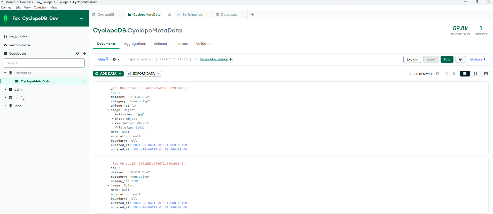

# Endocopic capsule for colorectal polyps diagnosis 

This is the first project i worked on during my internship as a Health Data scientist/ AI engineer at LIP6. The goal of the project was to to develop an innovative endoscopic capsule to improve colorectal cancer diagnosis. The idea is to embed in a capsule that can be ingested by the patient a software brick capable of capturing images, processing them using powerful algorithms, and reconstructing them in 3D. This capsule will enable only those images of interest to be selected and sent to the doctor via a remote external monitor, thus facilitating the diagnosis of colorectal cancer .

My main responsibilities included studying and conceiving protocols for medical data collection from future clinical trials,
Creating a database architecture adapted to the collection of data from endoscopic capsules, Organizing and Structuring of the Database with collected data to test the first prototypes of the capsule. And finally analyzing the Connect colorectal polyp classification(CONECCT) method based on existing medical methods, and also designing and implementing a machine learning-based inference model for the classification of colorectal polyps suitable for integration into an endoscopic capsule.


## Installation
For this project, you need to have Python and MongoDB installed on your machine, also install the PyMongo library to interact with MongoDB database using Python. You can check your Python version with:

```bash
python --version
```


## Authors

- [@Imaneelmissaoui](https://github.com/imaneelmissaoui)


## Screenshots



